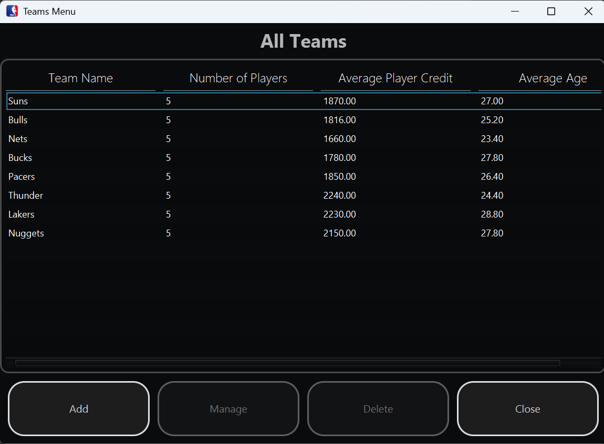
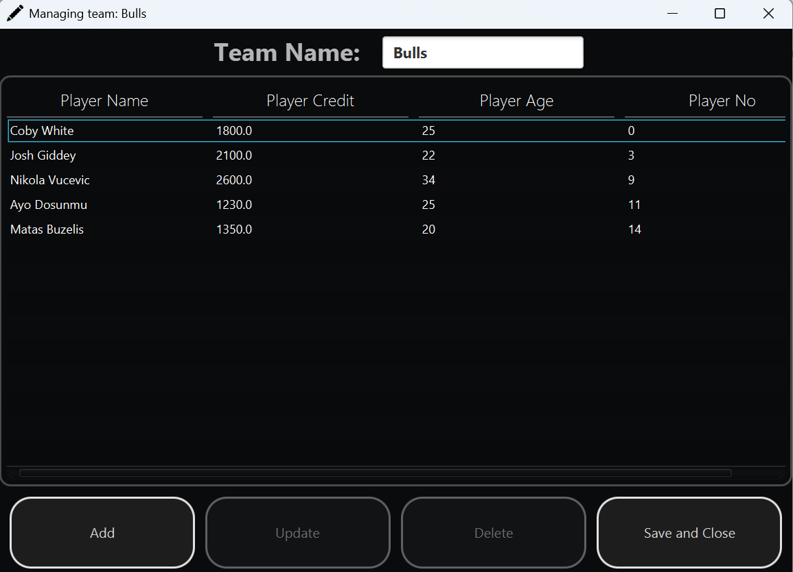
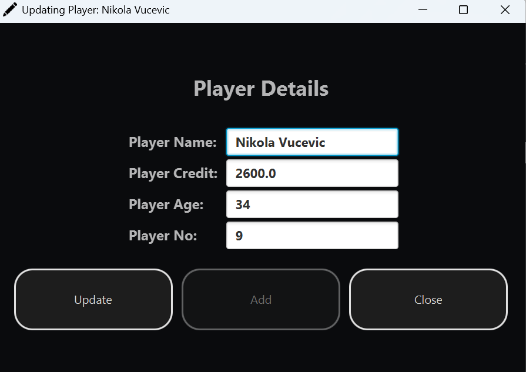
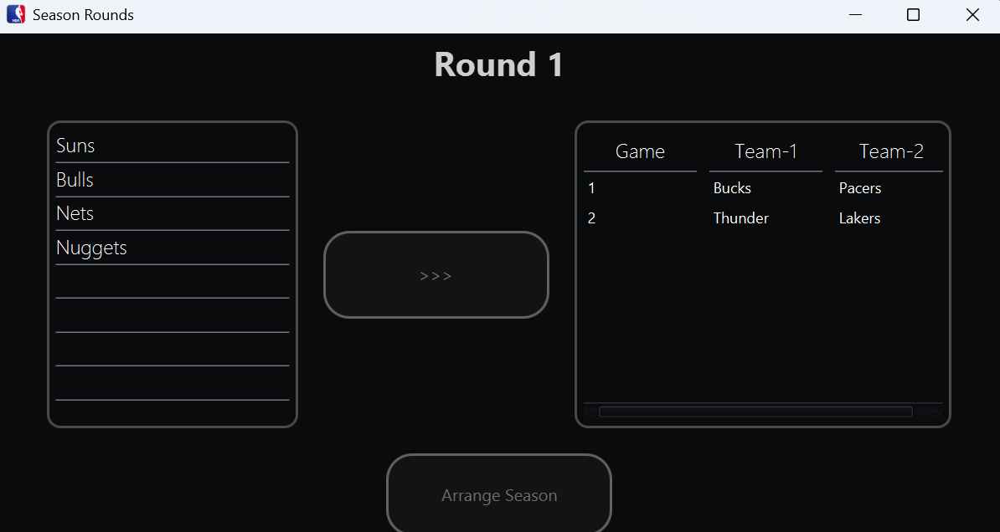

# NBA (Java GUI Project)

## A JavaFX GUI application that simulates an online NBA league. Allows for features such as simulating games, viewing players and managing teams.

# Features

- Adding teams, editing teams
- Adding players, editing players
- Delete players, delete teams
- View all players and their details
- Filtering by player name, credit level, age
- Simulating games

# Screenshots

## Teams Menu

## Players Menu

## Edit Player

## Assign Games

# How to Run
1. Run the "NBA" executable JAR file.

# Author
- Bill Ren